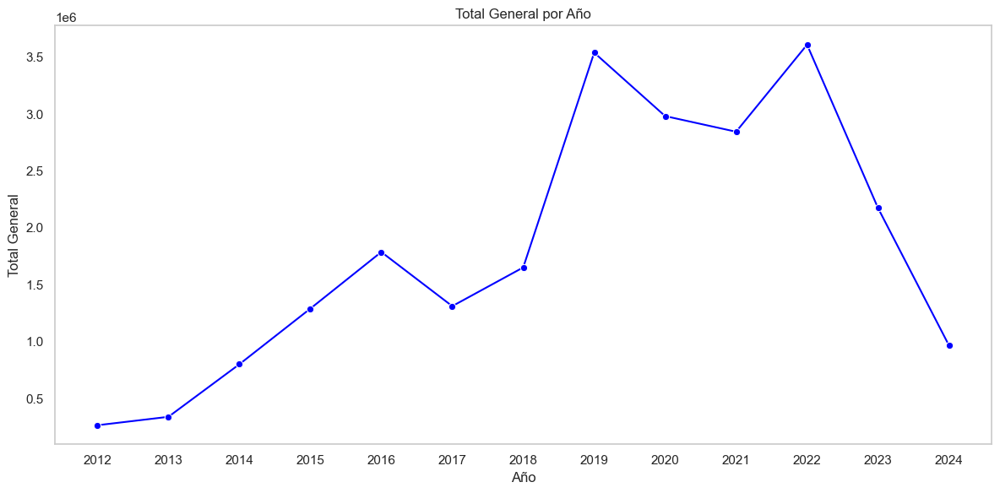
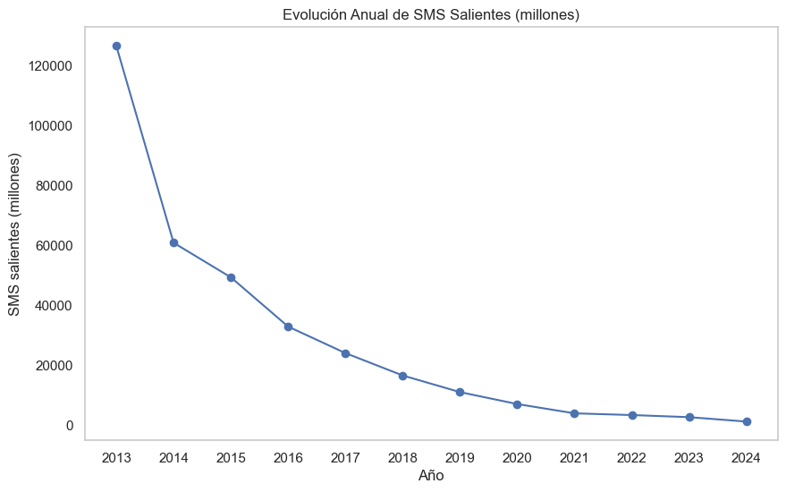
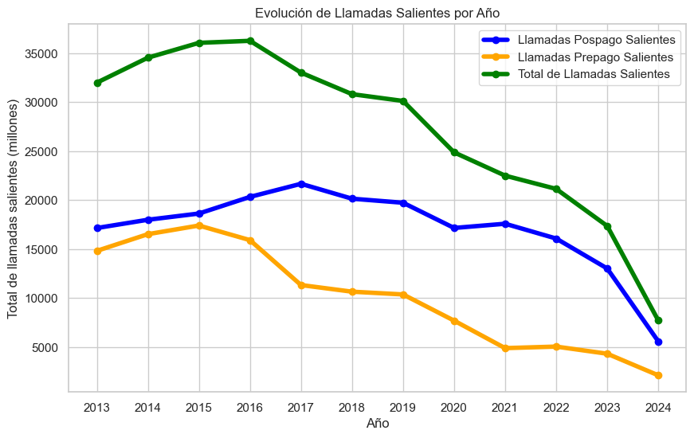
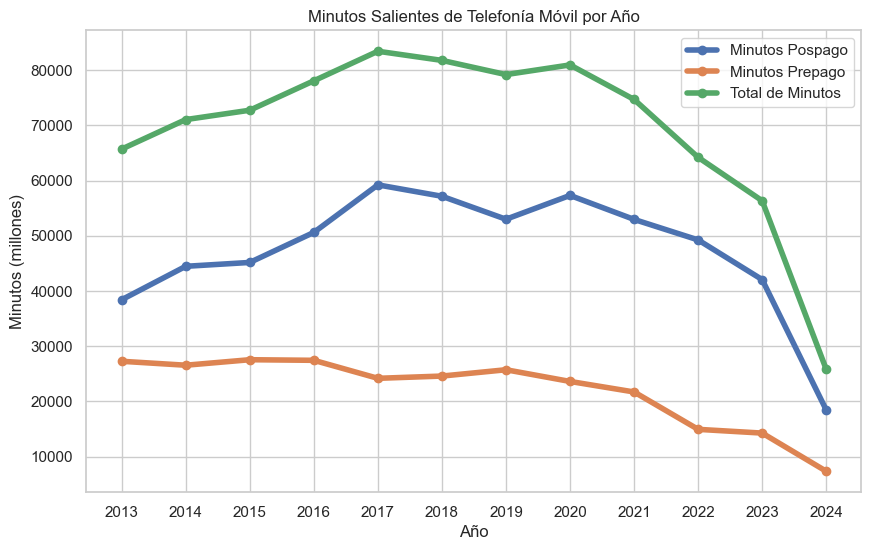

# Proyecto Individual II - Data Analytics 
### Por Alejandro Castellano - DSPT-12

## Introducción
Bienvenidos/as al repositorio de visualización, en esta oportunidad les presentaré el trabajo realizado bajo el rol de  <u>Analista de Datos</u>.  
El trabajo consistió en analizar datasets de acceso público, cito link, los cuales se refieren a datos de la industria de las telecomunicaciones en Argentina, separados por segmentos respecto a servicios de internet, telefonía celular (o móvil), televisión, telefonía fija y servicios postales, entre otros.  
En mi caso, utilicé los datasets referidos a Internet, Televisión, Telefonía Móvil y Telefonía Fija. Siendo que, la parte interesada en recibir el Dashboard sería una firma de telecomunicaciones.  

## Primer Etapa + EDA
Una vez descargados, los archivos se encuentran en formato .xlsx (más conocido como Excel), por lo que la carga en Python fue hoja por hoja, algo que se observará en el archivo correspondiente a EDA.  
Como primer medida, se analizaron las estructuras y el recuento obligatorio de faltantes, nulos y duplicados. Hay comentarios sobre cada caso distinto del general, donde se marcan las decisiones tomadas.  

### Internet
Luego de hacer un primer recorrido por el dataset principal referido a Internet, se normalizaron los dataframes respecto a sus variables de texto para tender a homogeneizar campos, siempre pensando en que luego habrá que relacionar todo en un DER (Diagrama Entidad Relación), que deberá ser iterativo y por lo tanto si ya desde el principio utilizamos ese enfoque, se facilitará el trabajo posterior.  
Se utilizaron gráficos para explicar los motivos por los cuales podrían ser de utilidad los distintos dataframes, así como se brindaron explicaciones de los motivos por los que no se utilizarían otros (ej:falta de datos temporales, inconsistencia de datos numéricos, etc).

## Gráfico de Demanda de Velocidad por Provincia
  
Se concluyó que la demanda de velocidad tiene tendencia alcista en la mayoría de las provincias, por lo que se consideraría oportuno presentar este tipo de información para un interesado en el sector.  

Continuando el análisis de internet, encontramos que había diferentes tecnologías de prestación de servicios, por lo que se dio forma a un gráfico de correlación para identificar posibles relaciones entre tecnologías y/o el paso del tiempo.

  
Observamos que el paso de los años tiene una correlación directa positiva con Wireless (inalámbrico), Fibra Óptica y Cablemodem en ese orden y que hay una correlación inversa negativa con ADSL.  
Dejando en claro que esta última tecnología tiende a desaparecer, volviéndose obsoleta para los planes futuros. La empresa debería concentrarse en las tres mencionadas con correlación positiva.

  
Para simplificar, se muestra las correlaciones de los distintos tramos de velocidad evaluados respecto al paso de los años.  
Las correlaciones negativas indicadas en colores fríos (azul,celeste) indican que sus demandas caen a medida que avanzan los años.  
En el otro caso, las positivas con colores cálidos (rojo,rosado), nos dicen que esas velocidades aumentan sus demandas conforme pasan los años.

  
Para finalizar el análisis de Internet, exponemos el crecimiento (nominal en pesos) del mercado en los últimos 10 años.

### Telefonía Fija
El dataset de 5 hojas nos permitió ahondar en el análisis de múltiples variables, como a continuación mostraremos, la evolución de la demanda a lo largo de los años, por provincia y segmento de consumidores.
  
Se observa que la demanda de servicios de telefonía fija ha disminuido, pero, el dato sobresaliente, que se reflejará de mejor forma en el Dashboard, es que el consumo de las familias sigue representando el 90% de la demanda, podría inferirse que las familias son el segmento más importante de la demanda, esto sirve para saber a dónde apuntar la oferta.

Para finalizar el segmento, se mostrará que los ingresos, al igual que con Interner, han aumentado (en pesos nominales) a lo largo de los últimos años.

### Telefonía Móvil

Analizamos portabilidad y nos demostró que las personas están menos interesadas en cambiar de compañía proveedora de telefonía celular.

Del mismo modo, tanto los mensajes de texto (SMS), como las llamadas y los minutos, han experimentado bajas en los últimos 10 años. Esto podría deberse a la irrupción de nuevas tecnologías de comunicación como Whatsapp, Telegram y las distintas redes sociales que permiten las comunicaciones a través de los servicios de internet de los distintos paquetes que ofrecen los proveedores. Vemos a continuación gráficos de lo mencionado.

Del mismo modo que los servicios analizados anteriormente, el volumen de mercado (market share) que alcanza este tipo de servicios, se ha incrementado en la última década analizada, cabe considerar que la moneda corriente (nominal en pesos), ayuda a que el mismo sea abultado.

Antes de cerrar este segmento, se hará mención al dato de accesos promedio cada 100 habitantes, el cual nos permitirá conocer como ha fluctuado la demanda respecto a la cantidad de habitantes, si consideramos que la población se ha incrementado (Censo 2010 - 40 millones de habitantes, censo 2022 - 45 millones de habitantes), podría derivarse que en definitiva el mantener un comportamiento lateral sería un indicador positivo.

### Televisión
El último segmento analizado, consideré que podría ser de interés para el potencial dueño de la empresa de telecomunicaciones, en caso de que su empresa pudiera integrarse de alguna forma y expandir su horizonte hacia una industria que, aún envejecida, mantiene su competitividad y rentabilidad.
El análisis comienza con la demanda de sucripciones por provincia, el gráfico a continuación (no es el más estético), muestra que la mayoría de las provincias no ha disminuido su nivel de demanda, hay casos de incremento como Tierra del Fuego, Santa Fe y Buenos Aires, y casos de disminución como Neuquen y Santa Cruz.

Como siguiente punto, se analizaron los dos principales métodos de provisión de servicios de televisión, sea satelital o por suscripción. El gráfico a continuación es determinante en cuanto a que el servicio por suscripción mantiene su atractivo, mientras que el servicio satelital está entrando en una debacle importante.

Como punto fuerte, debemos resaltar, al igual que todos los segmentos de negocio analizados, que el market share se ha incrementado, aún en ambos segmentos. Por lo tanto, si ha caído la demanda, pero los ingresos se han incrementado, esto nos indica que el incremento de los ingresos debido al aumento de los precios es más que proporcional al decremento de la demanda (de servicios satelitales). Es un concepto económico llamado Elasticidad Precio de la Demanda.

Con esto doy por finalizado la etapa EDA. Espero no haberme extendido de más.

## Dashboard
